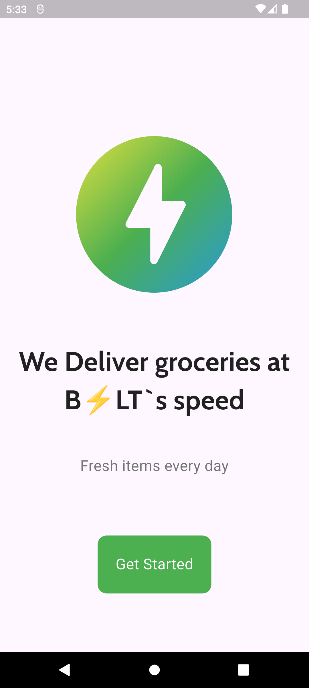
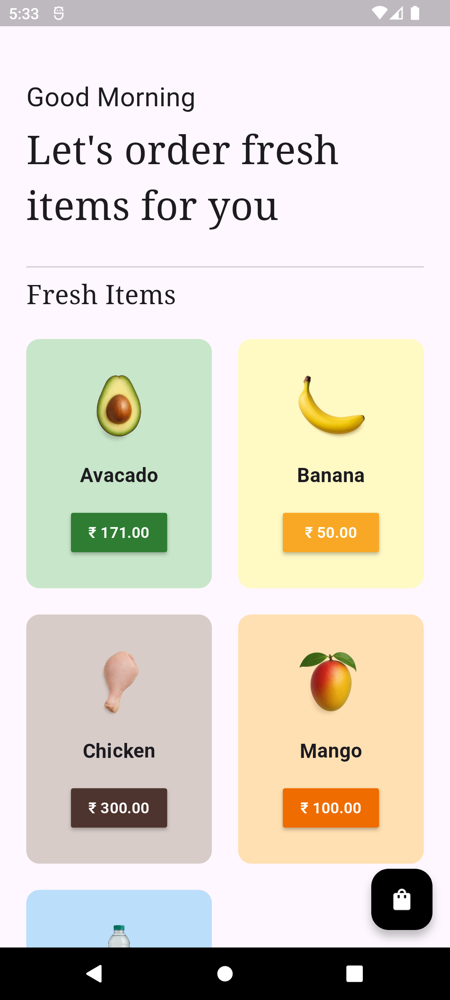

# Grocessory App

A Flutter-based grocery shopping application that uses the [Provider](https://pub.dev/packages/provider) package for state management. Users can browse groceries, add them to a cart, and place orders.

## Features

- Browse a catalog of grocery items
- View item details
- Add/remove items from the cart
- Place orders
- View order history
- State management using Provider

## Screenshots

| Home Screen | Item Details | Cart | Orders |
|:-----------:|:------------:|:----:|:------:|
|  |  |  | 

## Getting Started

To run this project:

1. Clone the repository.
2. Run `flutter pub get` to install dependencies.
3. Use `flutter run` to launch the app on your device or emulator.

## Resources

- [Provider Documentation](https://pub.dev/packages/provider)
- [Flutter Documentation](https://docs.flutter.dev/)
- [Write your first Flutter app](https://docs.flutter.dev/get-started/codelab)
- [Flutter Cookbook](https://docs.flutter.dev/cookbook)

---
For any issues or contributions, please open an issue or submit a pull request.
